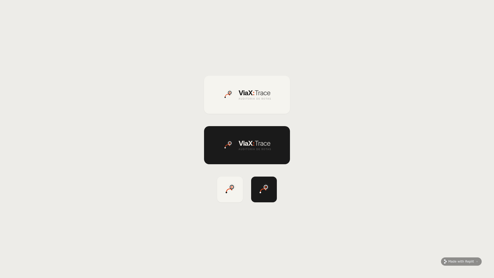

<div align="center">



# Comece aqui — Guia rápido (5 minutos)

**Da instalação à sua primeira auditoria de rota, sem jargão técnico.**

</div>

---

## Antes de começar — escolha seu caminho

> O ViaX:Trace pode ser usado de duas formas. Responda à pergunta abaixo e siga apenas o caminho indicado.

### Já tem o sistema rodando em algum computador ou no Termux do seu celular?

| 🟢 **Sim, alguém já instalou pra mim** | 🟠 **Não, vou instalar agora** |
|---|---|
| Pule para o **[Passo 4 — Crie sua conta](#passo-4--crie-sua-conta)**. | Comece pelo **[Passo 1 — Escolha sua plataforma](#passo-1--escolha-sua-plataforma)**. |

---

## Passo 1 — Escolha sua plataforma

Onde o ViaX:Trace vai rodar?

|  | 💻 **PC ou servidor** | 📱 **Celular Android (Termux)** |
|---|---|---|
| **Indicado para** | Equipes, escritório, uso intenso | Operação solo em campo, sem internet |
| **Você precisa** | Um Linux, macOS ou Windows | Um celular Android e o app **Termux** ([baixe aqui](https://f-droid.org/packages/com.termux/)) |
| **Tempo de instalação** | ~3 minutos | ~10 minutos (primeiro uso) |
| **Vai pro passo** | [2A](#passo-2a--instale-no-pc) | [2B](#passo-2b--instale-no-android-termux) |

> 💡 **Dica:** se você está em dúvida, comece pelo PC. É mais rápido e te dá uma noção do sistema antes de partir pro celular.

---

## Passo 2A — Instale no PC

Abra o terminal (Linux/macOS) ou o **PowerShell como Administrador** (Windows) e cole o comando da sua plataforma.

**Linux ou macOS**
```bash
curl -fsSL https://raw.githubusercontent.com/esmagafetos/Viax-Scout/main/install.sh | bash
```

**Windows**
```powershell
iwr -useb https://raw.githubusercontent.com/esmagafetos/Viax-Scout/main/install.ps1 | iex
```

Espere o instalador terminar. Ao final ele mostra uma mensagem em verde confirmando que a API e o frontend estão prontos.

➡️ **Vá para o [Passo 3 — Abra o sistema](#passo-3--abra-o-sistema)**

---

## Passo 2B — Instale no Android (Termux)

1. Abra o **Termux** no seu celular.
2. Cole o comando abaixo e toque em ENTER:

```bash
curl -fsSL https://raw.githubusercontent.com/esmagafetos/Viax-Scout/main/install-termux.sh | bash
```

3. Aguarde o instalador finalizar (pode levar 5–10 minutos no primeiro uso).
4. Quando terminar, **inicie o backend** com:

```bash
bash ~/viax-system/start-backend.sh
```

Você verá uma caixa verde com a mensagem **"ViaX:Trace Backend — Rodando!"** e a URL `http://127.0.0.1:8080`. **Deixe esse terminal aberto** — é ele quem está servindo o app.

➡️ **Vá para o [Passo 4 — Crie sua conta](#passo-4--crie-sua-conta)** *(o app mobile cuida do passo 3 sozinho).*

---

## Passo 3 — Abra o sistema

No navegador do mesmo computador onde você instalou, acesse:

> **http://localhost:5173**

Você verá a tela de **login** do ViaX:Trace.

<p align="center">
  
</p>

> ❓ **Apareceu "Cannot GET /" no navegador?** Você abriu a porta errada (`8080` é só pra API). Use **`5173`**.

---

## Passo 4 — Crie sua conta

1. Toque em **"Criar conta grátis"** abaixo do botão Entrar.
2. Preencha **nome, e-mail e senha** (mínimo 8 caracteres).
3. Confirme. Você é levado direto pro **Dashboard**.

> 🔐 **A primeira conta criada vira o administrador** do sistema. Guarde bem essa senha.

<p align="center">
  
</p>

📱 **Está usando o app Android?** Continue para o [Passo 5](#passo-5--conecte-o-app-ao-servidor-só-mobile).
💻 **Está no PC?** Pule direto para o [Passo 6](#passo-6--faça-sua-primeira-auditoria).

---

## Passo 5 — Conecte o app ao servidor *(só mobile)*

Quando você abre o APK pela primeira vez ele pede a URL do servidor que está rodando no Termux.

1. Confira que o terminal do Termux **continua aberto** com a mensagem verde "Rodando!".
2. No app, na tela **Configurar servidor**, toque no chip **`127.0.0.1:8080`** (ele aparece logo abaixo do campo).
3. Toque em **Testar conexão**. Você verá:
   - ✅ **"Conexão estabelecida"** — toque em **Continuar**.
   - ❌ **"Falha na conexão"** — veja a [seção Deu problema?](#deu-problema) no final.

> ⚠️ **Reconstruiu o APK depois de uma atualização?** Ele já vem com a permissão correta de rede. Se ainda assim der erro, [veja aqui](#deu-problema-app-não-conecta-no-termux).

---

## Passo 6 — Faça sua primeira auditoria

Para você experimentar sem precisar montar uma planilha do zero, baixe o exemplo:

> 📥 **[Baixar planilha-modelo (exemplo-rota.xlsx)](exemplo-rota.xlsx)**
>
> *(Arquivo pequeno com 5 entregas e coordenadas reais de teste.)*

Agora:

1. No menu, abra **Processar Rota**.
2. Toque em **"Selecionar arquivo"** e escolha o `exemplo-rota.xlsx`.
3. Toque em **Processar**.

O sistema mostra o progresso **linha-por-linha em tempo real** — cada endereço é geocodificado e comparado com o GPS da planilha.

<p align="center">
  
</p>

Quando terminar, você cai automaticamente no **Histórico** com seu primeiro relatório.

---

## Passo 7 — Leia o relatório

O relatório mostra cada linha da planilha com 3 informações principais:

| Coluna | O que significa | Quando se preocupar |
|---|---|---|
| **Distância** | Quantos metros separam o endereço informado e o GPS coletado | Acima de **100 m** geralmente indica entrega no lugar errado |
| **Similaridade** | Quão parecido o nome da rua informada é com a rua real do GPS (0–100%) | Abaixo de **68%** o sistema marca como **nuance** |
| **Nuance** | Sinal de divergência grave — endereço e GPS não batem | Sempre que aparecer, vale uma checagem manual |

> 💡 **Você pode ajustar os limiares** (distância máxima e similaridade mínima) em **Configurações → Tolerância**. Bom para empresas que operam em zonas rurais (mais tolerantes) ou em condomínios fechados (mais rigorosos).

Você pode **baixar o relatório completo em CSV** pelo botão no canto superior direito do histórico.

---

## 🎉 Pronto! Você concluiu sua primeira auditoria

A partir daqui:

- 🔁 **Faça upload das suas planilhas reais** em **Processar Rota**.
- 📊 Acompanhe métricas e tendências no **Dashboard**.
- 📂 Volte ao **Histórico** sempre que precisar reabrir um relatório antigo.
- 🏘️ Tem entregas em **condomínios**? Use a aba **Ferramenta** para ordenar a rota por Quadra/Lote automaticamente.
- ⚙️ Em **Configurações** você pode mudar avatar, ativar **GeocodeR BR** (precisão máxima para endereços brasileiros) ou trocar para **Google Maps** quando precisar de cobertura global.

---

## Deu problema?

### App não conecta no Termux

**Sintoma:** A tela de Setup mostra **"Servidor inacessível"** mesmo com o Termux aberto e rodando.

**O que verificar (em ordem):**

1. **O Termux está mesmo rodando o backend?** Volte ao terminal do Termux. Você precisa estar vendo a caixa verde "ViaX:Trace Backend — Rodando!" com a URL `http://127.0.0.1:8080` logo abaixo. Se sumiu, rode de novo:
   ```bash
   bash ~/viax-system/start-backend.sh
   ```
2. **Confirme que o servidor responde no navegador do mesmo aparelho.** Abra o Chrome do celular e digite `http://127.0.0.1:8080`. Se aparecer **"Cannot GET /"**, o backend está OK — essa é a resposta correta da porta da API. Se não carregar nada, o Termux não está servindo.
3. **Você está usando uma versão antiga do APK?** Atualize sempre para o APK mais recente da [página de Releases](https://github.com/esmagafetos/Viax-Scout/releases). Versões anteriores a `2.0.1` não tinham a permissão de rede correta para Android 14/15 e bloqueavam silenciosamente as conexões locais.
4. **Toque em outro chip** na tela de Setup (`localhost:8080` ou `10.0.2.2:8080`) e clique em **Testar conexão** — em alguns aparelhos com customizações da fabricante o `127.0.0.1` é tratado diferente.

### A planilha não foi aceita

**Sintoma:** Erro ao fazer upload em Processar Rota.

**Checklist mínimo:**
- O arquivo é `.xlsx` ou `.csv` (não vale `.xls` antigo).
- Tem no máximo **10 MB** e até **500 linhas**.
- Existe **pelo menos** uma coluna chamada `endereco`, `endereço` ou `address`.
- Latitude e longitude (se tiver) estão em **graus decimais** — ex.: `-23.55052`, **não** `23°33'02"S`.

> 💡 Em dúvida? Compare com a [planilha-modelo](exemplo-rota.xlsx) — ela tem o formato correto.

### "Cannot GET /" no navegador

Isso é **normal**. A porta `8080` é só pra API. Para usar a interface, abra **`http://localhost:5173`** (PC) ou o **app Android**.

### Esqueci minha senha

A primeira conta é o administrador. Se você só tem essa, no PC pode redefinir manualmente:

```bash
cd ~/viax-system
node -e "import('@workspace/db').then(async d => { /* contate o suporte para o script atual */ })"
```

Se for um usuário comum, peça ao administrador para criar uma nova conta para você.

---

## Quer ir mais fundo?

| Tópico | Onde ler |
|---|---|
| Recursos completos do sistema | [README — Funcionalidades](../README.md#-funcionalidades) |
| Arquitetura técnica | [README — Arquitetura](../README.md#-arquitetura) |
| Como contribuir com o código | [CONTRIBUTING.md](../CONTRIBUTING.md) |
| App nativo Android (build próprio) | [README — App Nativo Android](../README.md#-app-nativo-android) |
| Reportar um bug | [Abrir issue](https://github.com/esmagafetos/Viax-Scout/issues/new?template=bug_report.md) |

---

<div align="center">

**Voltar para o [README principal](../README.md)** · [Releases](https://github.com/esmagafetos/Viax-Scout/releases) · [Issues](https://github.com/esmagafetos/Viax-Scout/issues)

</div>
